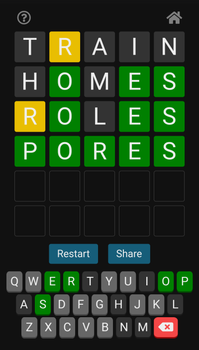

# Wordle made with Svelte

https://wordle-svelte.netlify.app

This is a version of the [Wordle game](https://www.powerlanguage.co.uk/wordle/) made with Svelte. You can choose between English and German.

 
 
The backend uses Netlify's serverless functions. The correct word is never visible to the client (unless the guess is correct, of course). Notice that in the original Wordle game the correct word is visible in the browser's localStorage, which makes it possible to cheat.

The German word list is generated from
https://sourceforge.net/projects/germandict/files/
