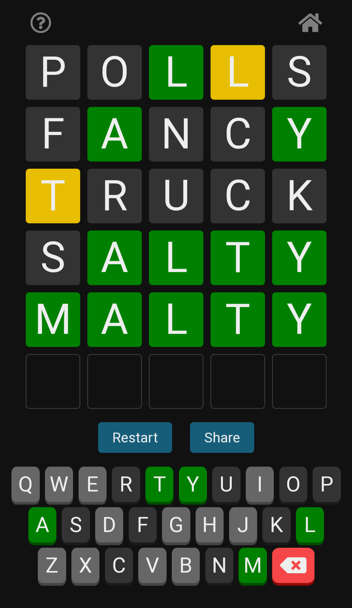
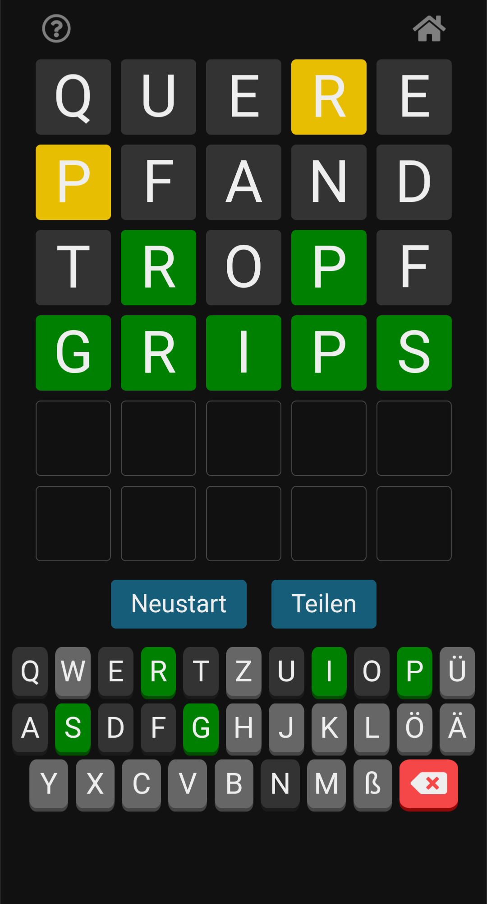

# Wordle made with Svelte

https://wordle-svelte.netlify.app

This is a version of [Wordle](https://www.powerlanguage.co.uk/wordle/) made with Svelte. You can choose between English and German.

 

This version is just a frontend application. It stores the correct word on the client side, which is not secure. For a more secure version including a backend, see the branch "serverless".
